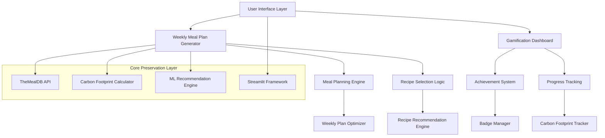
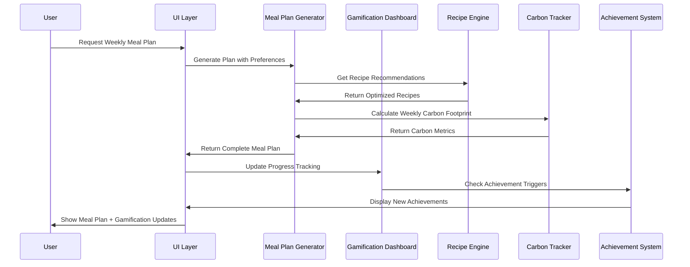

# Design Document: Weekly Meal Plan Generator and Carbon Footprint Gamification Dashboard

## Overview

This design document outlines the architecture for replacing the Fridge Inventory Scanner with a comprehensive Weekly Meal Plan Generator and Carbon Footprint Gamification Dashboard. The solution focuses on automated meal planning, gamified sustainability tracking, and enhanced user engagement while maintaining all existing EcoMealAI functionality including TheMealDB API integration, carbon footprint calculations, ML recommendations, and Streamlit UI components.

The design emphasizes user motivation through gamification, practical meal planning automation, and comprehensive progress tracking to encourage long-term sustainable eating habits.

## Architecture

### High-Level Architecture



### Component Interaction Flow



## Components and Interfaces

### 1. Weekly Meal Plan Generator

#### WeeklyMealPlanGenerator Class
```python
class WeeklyMealPlanGenerator:
    def __init__(self, recipe_db: RecipeDatabase, carbon_calc: CarbonFootprintCalculator)
    def generate_weekly_plan(self, preferences: UserPreferences) -> WeeklyMealPlan
    def optimize_for_variety(self, recipes: List[Recipe]) -> List[Recipe]
    def balance_nutritional_content(self, daily_meals: List[Recipe]) -> List[Recipe]
    def calculate_weekly_carbon_footprint(self, meal_plan: WeeklyMealPlan) -> float
    def generate_shopping_list(self, meal_plan: WeeklyMealPlan) -> ShoppingList
    def suggest_meal_prep_schedule(self, meal_plan: WeeklyMealPlan) -> PrepSchedule
```

#### MealPlanOptimizer Class
```python
class MealPlanOptimizer:
    def __init__(self, constraints: PlanningConstraints)
    def optimize_ingredient_overlap(self, recipes: List[Recipe]) -> List[Recipe]
    def minimize_food_waste(self, meal_plan: WeeklyMealPlan) -> WeeklyMealPlan
    def balance_preparation_time(self, daily_meals: List[Recipe]) -> List[Recipe]
    def ensure_dietary_compliance(self, recipes: List[Recipe], restrictions: List[str]) -> List[Recipe]
```

### 2. Carbon Footprint Gamification System

#### GamificationDashboard Class
```python
class GamificationDashboard:
    def __init__(self, user_profile: UserProfile)
    def calculate_carbon_points(self, weekly_footprint: float, baseline: float) -> int
    def update_user_streaks(self, current_footprint: float, target: float) -> StreakData
    def generate_progress_charts(self, historical_data: List[CarbonData]) -> Dict[str, Any]
    def get_personalized_insights(self, user_data: UserData) -> List[Insight]
    def compare_with_goals(self, current_progress: float, goals: List[Goal]) -> GoalProgress
```

#### AchievementSystem Class
```python
class AchievementSystem:
    def __init__(self, achievement_definitions: Dict[str, Achievement])
    def check_achievement_triggers(self, user_data: UserData) -> List[Achievement]
    def award_badge(self, user_id: str, badge: Badge) -> None
    def calculate_streak_achievements(self, streak_data: StreakData) -> List[Achievement]
    def generate_achievement_card(self, achievement: Achievement) -> AchievementCard
    def get_user_achievements(self, user_id: str) -> List[Achievement]
```

### 3. Progress Tracking and Analytics

#### CarbonFootprintTracker Class
```python
class CarbonFootprintTracker:
    def __init__(self, storage: DataStorage)
    def record_daily_footprint(self, user_id: str, date: datetime, footprint: float) -> None
    def get_weekly_trends(self, user_id: str, weeks: int) -> List[WeeklyTrend]
    def calculate_reduction_percentage(self, current: float, baseline: float) -> float
    def identify_best_worst_days(self, weekly_data: List[DailyData]) -> DayAnalysis
    def generate_improvement_suggestions(self, user_data: UserData) -> List[Suggestion]
```

#### ProgressAnalytics Class
```python
class ProgressAnalytics:
    def generate_trend_analysis(self, historical_data: List[CarbonData]) -> TrendAnalysis
    def calculate_goal_progress(self, current_data: UserData, goals: List[Goal]) -> GoalProgress
    def identify_patterns(self, user_behavior: List[BehaviorData]) -> List[Pattern]
    def predict_future_performance(self, historical_data: List[CarbonData]) -> Prediction
```

## Data Models

### Meal Planning Models

```python
@dataclass
class WeeklyMealPlan:
    user_id: str
    week_start_date: datetime
    daily_meals: Dict[str, DailyMeals]  # day -> meals
    total_carbon_footprint: float
    total_cost: float
    shopping_list: ShoppingList
    prep_schedule: PrepSchedule

@dataclass
class DailyMeals:
    breakfast: Recipe
    lunch: Recipe
    dinner: Recipe
    snacks: List[Recipe]
    daily_carbon_footprint: float
    daily_cost: float

@dataclass
class UserPreferences:
    dietary_restrictions: List[str]
    carbon_footprint_goal: float
    budget_limit: float
    max_prep_time: int
    cuisine_preferences: List[str]
    disliked_ingredients: List[str]

@dataclass
class ShoppingList:
    ingredients: Dict[str, IngredientItem]
    total_estimated_cost: float
    seasonal_items: List[str]
    local_options: List[str]
    
@dataclass
class IngredientItem:
    name: str
    quantity: float
    unit: str
    estimated_cost: float
    category: str
    is_seasonal: bool
    is_local: bool
```

### Gamification Models

```python
@dataclass
class UserProfile:
    user_id: str
    current_level: int
    total_points: int
    current_streak: int
    longest_streak: int
    achievements: List[Achievement]
    carbon_footprint_history: List[CarbonData]
    goals: List[Goal]

@dataclass
class Achievement:
    id: str
    name: str
    description: str
    badge_icon: str
    points_awarded: int
    date_earned: datetime
    category: str
    rarity: str

@dataclass
class CarbonData:
    date: datetime
    daily_footprint: float
    weekly_average: float
    reduction_from_baseline: float
    meals_logged: int

@dataclass
class Goal:
    id: str
    type: str  # 'carbon_reduction', 'streak', 'recipe_diversity'
    target_value: float
    current_progress: float
    deadline: datetime
    is_achieved: bool

@dataclass
class StreakData:
    current_streak: int
    longest_streak: int
    streak_type: str
    last_activity_date: datetime
```

## Error Handling

### Meal Plan Generation Errors

1. **Recipe Availability Issues**
   - Fallback to alternative recipes with similar carbon footprint
   - Expand search criteria if insufficient recipes found
   - Notify user of constraint relaxation

2. **Nutritional Balance Failures**
   - Provide warnings about nutritional gaps
   - Suggest supplementary recipes or ingredients
   - Allow user override with acknowledgment

3. **Budget/Carbon Constraint Conflicts**
   - Present trade-off options to user
   - Suggest constraint adjustments
   - Provide alternative planning strategies

### Gamification System Errors

1. **Achievement Calculation Errors**
   - Log errors for manual review
   - Provide conservative achievement awards
   - Allow manual achievement correction

2. **Progress Tracking Failures**
   - Maintain data integrity with rollback capabilities
   - Provide estimated values when exact calculation fails
   - Alert user to data inconsistencies

## Testing Strategy

### Meal Planning Testing

1. **Plan Generation Testing**
   - Test with various dietary restrictions and preferences
   - Validate nutritional balance across generated plans
   - Test constraint satisfaction (budget, carbon, time)

2. **Optimization Testing**
   - Verify ingredient overlap optimization
   - Test food waste minimization algorithms
   - Validate preparation time balancing

3. **Integration Testing**
   - Test with existing recipe recommendation engine
   - Validate carbon footprint calculations
   - Test shopping list generation accuracy

### Gamification Testing

1. **Achievement System Testing**
   - Test all achievement trigger conditions
   - Validate point calculation accuracy
   - Test streak tracking reliability

2. **Progress Tracking Testing**
   - Test data persistence and retrieval
   - Validate trend calculation accuracy
   - Test goal progress tracking

3. **User Experience Testing**
   - Test dashboard responsiveness
   - Validate achievement notification system
   - Test sharing functionality

### Performance Testing

1. **Meal Plan Generation Performance**
   - Target: < 5 seconds for weekly plan generation
   - Test with large recipe databases
   - Validate memory usage during optimization

2. **Dashboard Loading Performance**
   - Target: < 2 seconds for dashboard rendering
   - Test with extensive historical data
   - Validate chart generation performance

## Implementation Considerations

### Data Persistence
- Store meal plans and user progress in session state
- Implement data export/import for user data portability
- Consider future database integration for multi-user support

### User Experience
- Progressive disclosure of advanced features
- Intuitive drag-and-drop meal plan editing
- Clear visual feedback for achievements and progress
- Mobile-responsive design for meal plan viewing

### Scalability
- Modular achievement system for easy expansion
- Configurable gamification rules
- Extensible meal planning constraints
- Plugin architecture for new gamification features