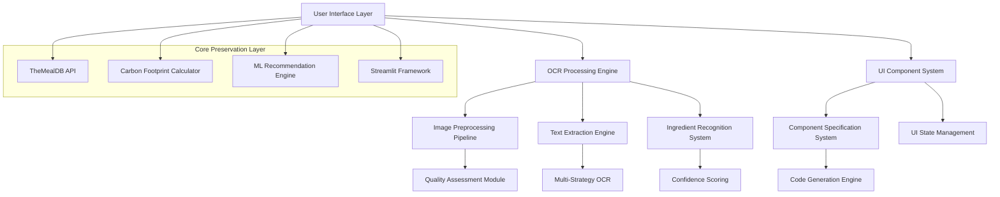
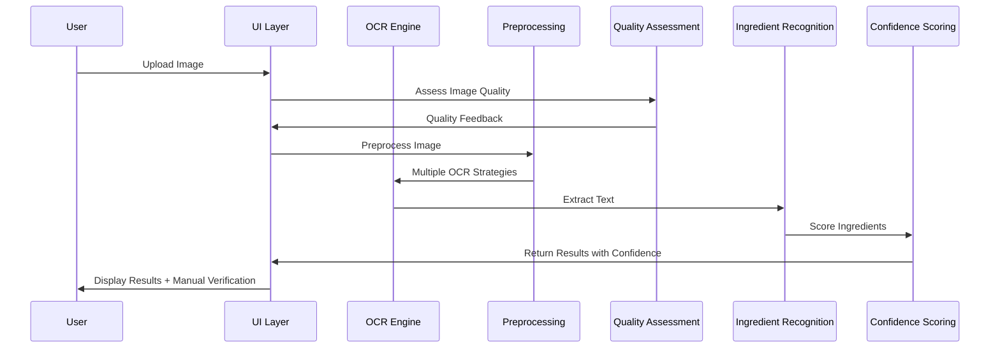

# Design Document: OCR Preprocessing and UI Refinement Optimization

## Overview

This design document outlines the architecture and implementation strategy for enhancing OCR preprocessing capabilities and implementing a systematic UI refinement workflow for the EcoMealAI application. The solution focuses on improving ingredient detection accuracy through advanced image processing techniques while maintaining all existing functionality including TheMealDB API integration, carbon footprint calculations, ML recommendations, and Streamlit UI components.

The design emphasizes modularity, performance optimization, and user experience improvements while ensuring backward compatibility and system reliability.

## Architecture

### High-Level Architecture



### Component Interaction Flow



## Components and Interfaces

### 1. Enhanced OCR Processing Engine

#### ImagePreprocessor Class
```python
class ImagePreprocessor:
    def __init__(self, config: Dict[str, Any])
    def assess_image_quality(self, image: PIL.Image) -> QualityMetrics
    def apply_adaptive_preprocessing(self, image: PIL.Image, quality_metrics: QualityMetrics) -> PIL.Image
    def apply_noise_reduction(self, image: PIL.Image) -> PIL.Image
    def enhance_contrast_adaptive(self, image: PIL.Image) -> PIL.Image
    def apply_morphological_operations(self, image: PIL.Image) -> PIL.Image
```

#### MultiStrategyOCR Class
```python
class MultiStrategyOCR:
    def __init__(self, strategies: List[OCRStrategy])
    def extract_text_parallel(self, image: PIL.Image) -> List[OCRResult]
    def combine_results(self, results: List[OCRResult]) -> str
    def get_best_strategy(self, image_quality: QualityMetrics) -> OCRStrategy
```

#### IngredientRecognitionEngine Class
```python
class IngredientRecognitionEngine:
    def __init__(self, ingredient_database: Dict[str, List[str]])
    def extract_ingredients_with_confidence(self, text: str) -> List[IngredientMatch]
    def apply_fuzzy_matching(self, text: str) -> List[IngredientMatch]
    def learn_from_corrections(self, original: str, corrected: str) -> None
    def get_disambiguation_options(self, ambiguous_text: str) -> List[str]
```

### 2. Image Quality Assessment System

#### QualityAssessment Class
```python
class QualityAssessment:
    def analyze_brightness(self, image: PIL.Image) -> float
    def analyze_contrast(self, image: PIL.Image) -> float
    def analyze_sharpness(self, image: PIL.Image) -> float
    def analyze_noise_level(self, image: PIL.Image) -> float
    def generate_improvement_suggestions(self, metrics: QualityMetrics) -> List[str]
    def calculate_overall_score(self, metrics: QualityMetrics) -> float
```

### 3. UI Component Specification System

#### ComponentSpecificationEngine Class
```python
class ComponentSpecificationEngine:
    def analyze_current_ui(self, component_path: str) -> UIAnalysis
    def generate_improvement_spec(self, analysis: UIAnalysis, requirements: List[str]) -> ComponentSpec
    def validate_spec_compatibility(self, spec: ComponentSpec) -> ValidationResult
    def generate_implementation_tasks(self, spec: ComponentSpec) -> List[Task]
```

#### UIStateManager Class
```python
class UIStateManager:
    def preserve_state_during_updates(self, component_id: str, state: Dict[str, Any]) -> None
    def restore_state_after_updates(self, component_id: str) -> Dict[str, Any]
    def validate_state_integrity(self, component_id: str) -> bool
    def handle_state_migration(self, old_version: str, new_version: str) -> None
```

### 4. Performance Optimization Layer

#### CacheManager Class
```python
class CacheManager:
    def cache_ocr_results(self, image_hash: str, results: OCRResult) -> None
    def get_cached_results(self, image_hash: str) -> Optional[OCRResult]
    def cache_preprocessed_images(self, original_hash: str, processed_image: PIL.Image) -> None
    def cleanup_expired_cache(self) -> None
```

#### ProgressTracker Class
```python
class ProgressTracker:
    def track_ocr_progress(self, stage: str, progress: float) -> None
    def estimate_completion_time(self, current_progress: float) -> float
    def provide_status_updates(self, callback: Callable[[str, float], None]) -> None
```

## Data Models

### OCR Processing Models

```python
@dataclass
class QualityMetrics:
    brightness: float
    contrast: float
    sharpness: float
    noise_level: float
    overall_score: float
    improvement_suggestions: List[str]

@dataclass
class OCRResult:
    text: str
    confidence: float
    strategy_used: str
    processing_time: float
    bounding_boxes: List[BoundingBox]

@dataclass
class IngredientMatch:
    ingredient: str
    confidence: float
    matched_text: str
    position: Tuple[int, int]
    alternatives: List[str]

@dataclass
class PreprocessingConfig:
    adaptive_threshold: bool
    noise_reduction_level: int
    contrast_enhancement: float
    brightness_adjustment: float
    morphological_operations: List[str]
```

### UI Specification Models

```python
@dataclass
class ComponentSpec:
    component_id: str
    current_implementation: str
    proposed_changes: List[str]
    compatibility_requirements: List[str]
    performance_targets: Dict[str, float]
    accessibility_requirements: List[str]

@dataclass
class UIAnalysis:
    component_type: str
    current_performance: Dict[str, float]
    accessibility_issues: List[str]
    user_experience_gaps: List[str]
    technical_debt: List[str]

@dataclass
class ValidationResult:
    is_valid: bool
    compatibility_issues: List[str]
    performance_concerns: List[str]
    recommendations: List[str]
```

## Error Handling

### OCR Error Recovery Strategy

1. **Preprocessing Failures**
   - Fallback to basic preprocessing
   - Provide user guidance for image improvement
   - Log failure patterns for analysis

2. **OCR Library Failures**
   - Graceful degradation to manual input
   - Clear installation instructions
   - Alternative OCR strategy selection

3. **Ingredient Recognition Failures**
   - Fuzzy matching fallbacks
   - User correction interface
   - Learning from user feedback

### UI Update Error Handling

1. **Component Update Failures**
   - Automatic rollback to previous version
   - State preservation during failures
   - User notification with recovery options

2. **Compatibility Issues**
   - Pre-update validation
   - Incremental update approach
   - Backward compatibility maintenance

## Testing Strategy

### OCR Testing Framework

1. **Image Quality Testing**
   - Synthetic image generation with known quality metrics
   - Real-world image dataset validation
   - Edge case scenario testing (poor lighting, blur, etc.)

2. **OCR Accuracy Testing**
   - Ground truth ingredient label dataset
   - Multi-strategy comparison testing
   - Performance benchmarking

3. **Ingredient Recognition Testing**
   - Fuzzy matching accuracy validation
   - Confidence scoring calibration
   - User correction learning validation

### UI Testing Framework

1. **Component Specification Testing**
   - Spec generation accuracy validation
   - Implementation task completeness testing
   - Compatibility validation testing

2. **UI State Management Testing**
   - State preservation during updates
   - State migration testing
   - Concurrent user interaction testing

3. **Performance Testing**
   - OCR processing speed benchmarks
   - UI responsiveness measurements
   - Memory usage optimization validation

### Integration Testing

1. **End-to-End OCR Workflow**
   - Image upload to ingredient detection
   - Error handling and recovery flows
   - User correction and learning cycles

2. **UI Refinement Workflow**
   - Specification to implementation pipeline
   - Component update and rollback procedures
   - State preservation across updates

3. **Core Functionality Preservation**
   - TheMealDB API integration validation
   - Carbon footprint calculation accuracy
   - ML recommendation system integrity
   - Streamlit UI component compatibility

### Performance Benchmarks

1. **OCR Performance Targets**
   - Image preprocessing: < 3 seconds for standard images
   - Text extraction: < 5 seconds for multi-strategy approach
   - Ingredient recognition: < 1 second for confidence scoring

2. **UI Performance Targets**
   - Component specification generation: < 2 seconds
   - UI update implementation: < 10 seconds per component
   - State preservation: < 100ms for typical state sizes

3. **System Integration Targets**
   - End-to-end OCR workflow: < 10 seconds
   - UI refinement cycle: < 30 seconds per component
   - Core functionality response time: < 2 seconds

## Implementation Considerations

### Backward Compatibility
- All existing API interfaces must remain functional
- Configuration migration for new OCR settings
- Graceful fallback to current OCR implementation if new system fails

### Performance Optimization
- Parallel processing for multiple OCR strategies
- Image caching to avoid reprocessing
- Lazy loading for UI components
- Memory-efficient image processing

### User Experience
- Progressive disclosure of advanced OCR features
- Clear feedback during processing
- Intuitive ingredient correction interface
- Responsive design maintenance

### Scalability
- Modular architecture for easy feature additions
- Configuration-driven OCR strategy selection
- Plugin architecture for new UI components
- Extensible ingredient database management